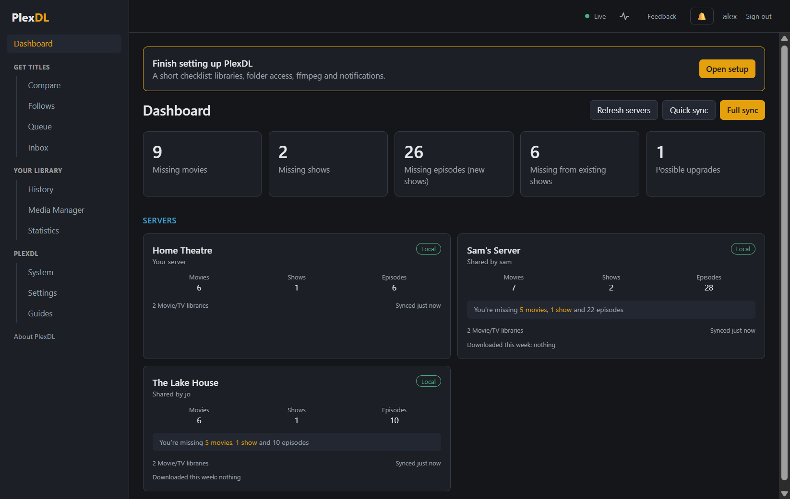
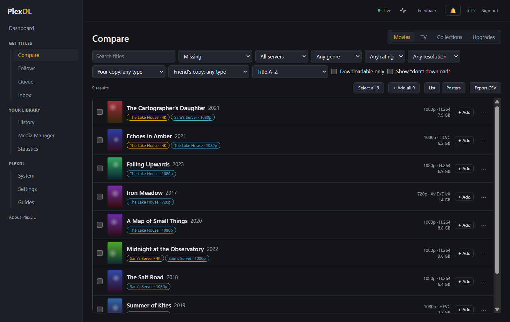
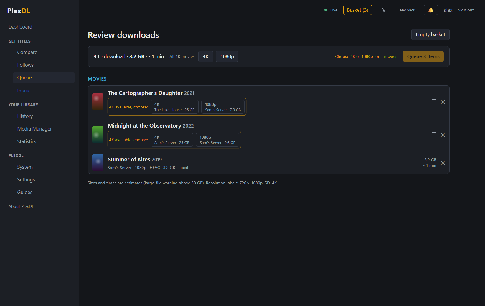
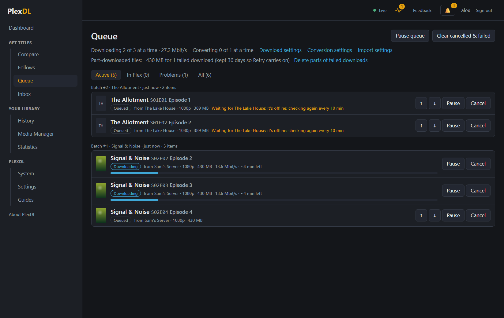

# Quick start

PlexDL compares the Plex libraries your friends share with you against your own Plex, downloads what you're
missing, converts it so it plays everywhere, and adds it to the right library in your Plex. It runs on the PC
that runs your Plex Media Server and you use it from a web browser.

## In five steps

1. **Install** PlexDL on your Plex server: run `PlexDL-Setup-x.y.z.exe` there (see
   [Installing and upgrading](02-install.md)).
2. **Sign in with Plex** using the account that owns the server. The setup wizard opens: eight short steps
   (what to compare, where files go, their format, how kind to be to friends…), each with sensible
   defaults. Skip any step, or the whole thing; **System → Run setup again** brings it back.
3. **Finish** runs the first sync and opens Compare. After that PlexDL keeps itself up to date.
4. **Compare → Movies / TV**: press **+ Add** on what you want, then **Basket → Review → Queue**
   (see [Finding and downloading](03-compare-and-download.md)).
5. Watch the **Queue**: each title downloads, converts, and is added to Plex. **History** can undo any of them.

_The screenshots use made-up friends and films._

## The guides

- [Installing and upgrading](02-install.md): installing on the Plex server, moving from a trial install,
  upgrades, the limited service account, uninstalling.
- [Finding and downloading](03-compare-and-download.md): Compare, upgrades, the basket, the queue, where files
  go, History and undo.
- [Following shows and automation](04-automation.md): Follows, your Plex Watchlist, download windows,
  schedules and notifications.
- [Media Manager](05-media-manager.md): tidying your own library safely.
- [Troubleshooting](06-troubleshooting.md): offline servers, slow or blocked downloads, logs and getting help.
- [Plex on a different PC](07-plex-on-another-pc.md): running PlexDL on another PC on your network: shares,
  the service account, folder mappings and ports.
- [Settings explained](08-settings.md): what each box on the Settings page does.
- [Words used in PlexDL](09-glossary.md): direct play, remux, staging, night shift and the rest.

Everywhere in PlexDL, a **?** next to a heading opens the matching part of these guides, and words with a dotted
underline show what they mean when you point at them.

## Good to know

- PlexDL only downloads what server owners allow, and only from Plex and Jellyfin servers shared with you.
  It never downloads from Netflix, Disney+ or other streaming services.
- It isn't made by or connected with Plex Inc. or the Jellyfin project.
- Nothing is ever deleted from your library: replaced or removed files go to a `PlexDL Backup` folder next to
  the library, and changes can be undone.
- Your PlexDL data (settings, history, the encrypted sign-in) lives in `C:\ProgramData\PlexDL`, with a daily
  backup.
