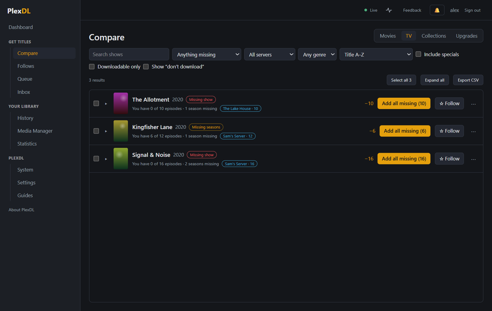
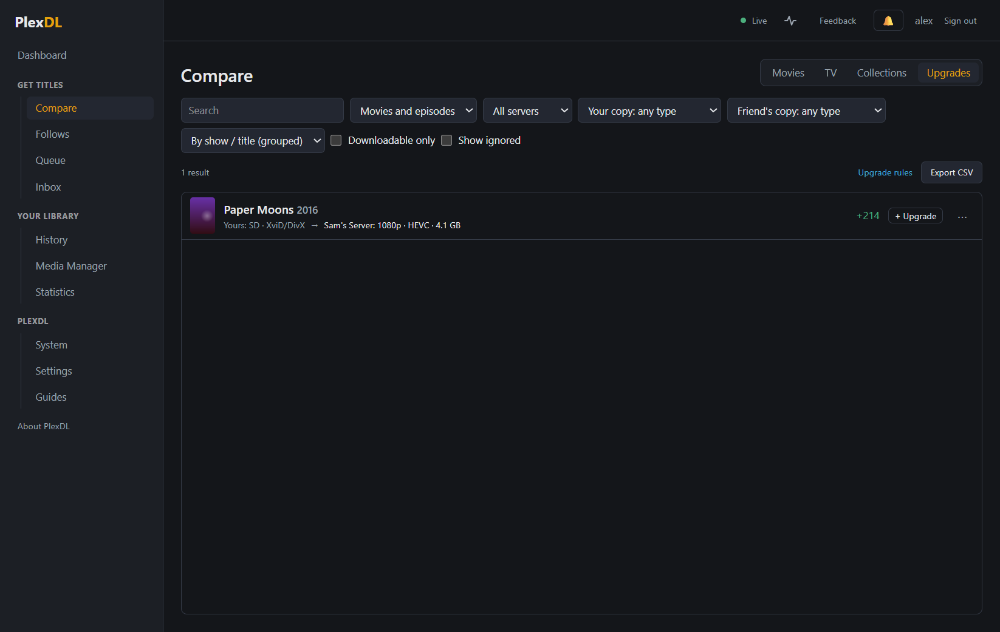
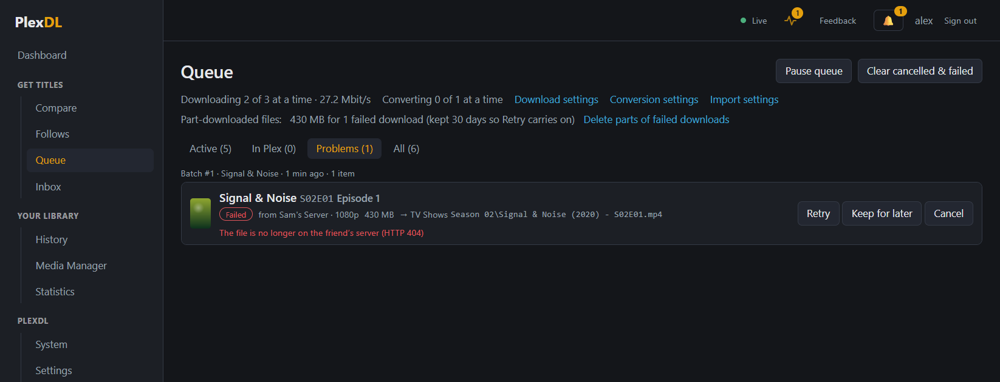
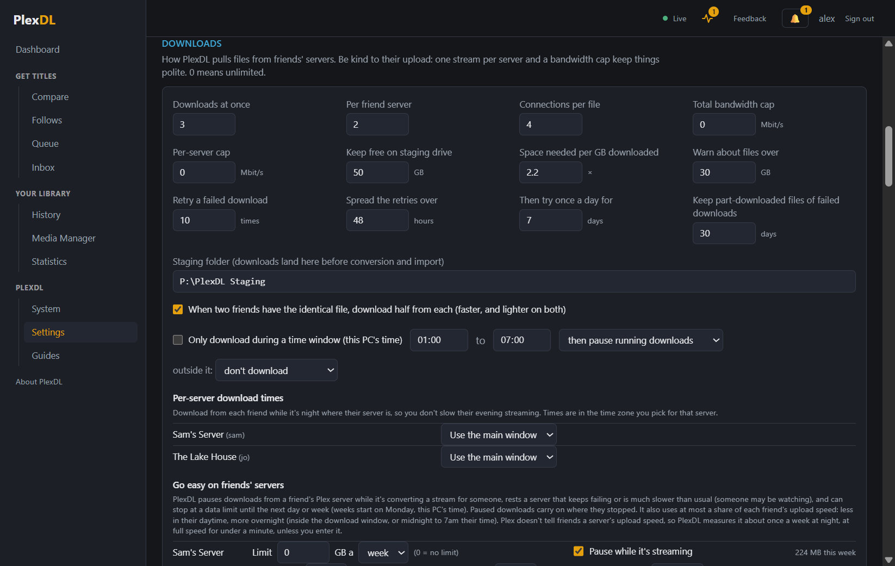

# Finding and downloading

## Keeping the lists up to date

PlexDL keeps its own index of your library and your friends' libraries. The **Dashboard** shows each server
with what you're missing from it. **Full sync** reads everything; **Quick sync** only fetches what changed.
Both also run on their own (a full sync every night and quick syncs through the day: Settings → Schedule).

Each count on the Dashboard also says roughly how much space it would take (for example "7,219 Missing movies
≈ 8.0 TB"), and so does each friend's card. Below the counts, **Getting all of it needs** adds it up and shows,
for each drive it would land on, how much is heading there and how much is free. As when PlexDL adds them, new films and
new shows go to your default film and TV library (on its drive with most room, if it has several), and
episodes for shows you have and upgrades go next to your copies. A drive that can't take it all is shown in amber, so you can pick what matters most. The sizes are your friends' files, counting the copy PlexDL would pick (the best up
to 1080p, or 4K if that's all there is). Converting often makes files smaller, so treat it as an upper
estimate. Upgrades need room for the new copy while your old one waits in the PlexDL Backup folder; once the
backup is emptied, they only take the difference.
Choose which friends' libraries count in **Settings → Compare scope**. Titles are matched by their IMDb, TMDB
and TVDB ids, not by name or library, so it doesn't matter what your friends call their libraries.

## Compare

- **Movies**: films a friend has and you don't. Filter by friend, year, genre, rating or quality; each row says
  who has it, in what quality and how big it is. Two **file type** filters pick titles by your copy's type and by
  a friend's copy's type: AVI, MKV, MP4, TS, WMV files, or HEVC/x265, H.264/x264, XviD/DivX, MPEG-2, VC-1, AV1,
  VP9 video. For example, *Your copy: AVI file* with **Already owned** lists your old AVI films, and *Friend's
  copy: HEVC / x265* shows the ones you could get as smaller HEVC files. The same filters are on **Upgrades**
  (films and episodes).
- **TV**: shows grouped by show and season. Shows you don't have at all, and the episodes missing from shows you
  do have. **Add season** or **Add all missing** takes everything missing at once.
- **Upgrades**: titles a friend has in clearly better quality than your copy (how much better, and whether 4K
  counts, is set in Settings → Upgrades).
- **Collections**: film collections and franchises (the Alien films, James Bond, Toy Story…) you have part of:
  "You have 1 of 4", with what's missing listed underneath and which friend has each one. **Download N missing**
  queues them straight away (1080p or 4K when there is one); **Add to basket** lets you review them first. To get
  several collections at once, tick them (or **Select all … with films to get**) and press **Download** in the bar
  that appears; each collection is queued as its own batch.
  **Follow** gets new parts as friends get them. Films nobody has, or that aren't out yet, are shown but not
  counted against you. PlexDL learns which collection each film is in from Plex's own catalogue after each
  sync (the first time takes a few minutes; **Look up now** starts it).

  **Collections in your Plex**: at the top of the page you can let Plex build these collections in your own
  libraries ("From 2 films" means a collection appears once you have two of its films). Tick **Also refresh the
  library's metadata** so films you already have join; Plex does that in the background and it can take a
  while.

**A–Z**: when Movies or TV is sorted by title (the default), the letters above the list jump straight to that
letter (**#** is titles starting with a number or symbol; a leading "The" or "A" is ignored, so *The Matrix* is under
M). Letters with nothing under them are greyed out.

A **Downloads not permitted** badge means the owner hasn't allowed downloads from that library; those titles
are listed but can't be added.

**Don't download**: tick titles (or **Select all** for everything matching your filters) and choose **Don't
download**, or use the ⋯ menu on one title, season or episode. They leave the lists and every count on the
Dashboard, and are never auto-followed. Changed your mind? Tick **Show "don't download"**, select them and choose
**Download after all** (or use Settings → Not downloading).

## Basket, review and queue

1. **+ Add** puts a title in the **Basket** (top right).
2. **Review** the basket before anything downloads:
   - when several friends have a title, pick the source (PlexDL suggests the best and fastest);
   - for films that come in 4K, choose 4K or 1080p (TV defaults to 1080p);
   - sizes and rough download times are shown, and PlexDL warns you if a drive would run short.
3. **Queue** them. The **Queue** page shows every title as it downloads, converts and is added to Plex, with
   **Pause**, **Resume**, **Cancel**, **Retry** and priority. Its tabs: **Active** (everything still on its way),
   **Downloading** (only what's being downloaded right now), **In Plex**, **Problems** and **All**.

Downloads resume where they stopped after a restart or a dropped connection, and large files download in
several parts at once (much faster from a far-away server). Speed limits, how many run at once and night-time
windows per friend's server are in **Settings → Downloads**.

When another friend has exactly the same file (same size, and the same bytes where PlexDL checks), half of it
comes from them: faster, and lighter on both servers. Each friend's limits, busy times and download windows still
apply; if the second friend gets busy or drops out, the first one finishes the rest. You can turn this off in
**Settings → Downloads**.

### When downloads fail

- **Retries:** a failed download tries again by itself: 10 times over 48 hours to start with, soon after a blip and
  further apart later, then once a day for a week. Each retry carries on from what's already downloaded. The
  Queue shows "Retry 3 of 17 at 14:30", and a failed download says when it will try again. Change the numbers in
  **Settings → Downloads**. A file that's gone from the friend's server, or that they don't let you download,
  isn't retried.
- **A friend goes offline:** the download waits for them ("Waiting for Alice: it's offline"), checking every 10
  minutes, without using up its retries, and carries on from where it stopped when they're back. If another
  friend has a copy of the same size, it carries on from them instead. PlexDL first checks that the bytes it
  already has match their copy, and starts again if they don't.
- **Keep for later:** on a failed download, this stops the retries and keeps what's downloaded with no deadline.
  **Resume** carries on from there; **Cancel** deletes it.
- **Space:** parts of failed downloads are kept for 30 days (so **Retry** carries on), then deleted. The Queue
  and System pages show how much space they take, with **Delete parts of failed downloads**.

## Converting

Each download is checked and, if needed, converted so it plays directly on TVs, phones and browsers without
Plex converting it on the fly: an MP4 with H.264 (or HEVC for 4K), audio your devices play, and subtitles in
your languages kept. Files that already play everywhere are just repackaged. Your graphics chip is used when
there is one. **Settings → Conversion** sets the quality, languages and video format; PlexDL pauses conversions
while someone is watching something Plex has to convert.

## Adding to Plex

PlexDL puts each title in the right library and folder with Plex's naming:

- a show you already have goes into its existing folder, in the same season-folder style;
- a library with folders on several drives (added in Plex under *Manage Library → Edit → Add folders*): new films
  and new shows go to the folder with the most free space. When a show's own drive is nearly full (less than
  10 GB would be left), its new episodes go in a folder of the same name on the library's roomiest drive, and Plex
  shows both as one show. Separate libraries don't count: add the folder to the same library (PlexDL notices
  new folders when it next refreshes your servers, or press **Refresh servers** on the Dashboard);
- children's titles can go to a Kids library;
- your own rules (by genre, rating, friend's library or title) come first: **Settings → Import into Plex**,
  with a tester that shows where a title would go and why.

Then it asks Plex to scan just that folder and checks Plex matched the right title. Anything doubtful waits in
the Queue for you to look at, with a link to it in Plex.

Upgrades replace your old copy; the old one is kept in the `PlexDL Backup` folder next to that library.

If a title arrives without subtitles in your languages, PlexDL then looks for them: with Plex's own subtitle
search, and OpenSubtitles.com if you've set it up. It checks they're in time with the speech (and fixes them if
not) and saves them next to the video. History shows what it found. See
[Settings → Subtitles](08-settings.md#subtitles).

## Files from elsewhere: the Inbox

Got a film or episode some other way? Turn on **Inbox** (in the menu), choose a folder (for example `D:\Inbox`)
and drop videos into it, in folders if you like. Every minute PlexDL looks for new files, leaving each one a
minute first in case it's still copying in. It works out what each file is from its name and folders
(`Arrival.2016.1080p.mkv`, `Spaced S01E03.avi`, `Doctor Who (2005)\Season 2\2x04.mkv`), checking your Plex, your
friends' libraries and Plex's online catalogue. Then it converts and adds the file exactly like a download: an
episode of a show you have goes next to your other episodes. Subtitle files with the same name
(`Arrival.2016.1080p.en.srt`) come along. Once Plex has it, the file is deleted from the inbox.

Files PlexDL is sure about go straight in (you can turn that off). The rest wait on the Inbox page with the
reason: the name matches more than one title, the film has no year, it isn't found anywhere, the file holds
more than one episode, or you already have it (importing then replaces your copy, which goes to the backup
folder). **Import** goes ahead, **Change**
searches for the right title (and asks for the season and episode of a show), and **Don't import** leaves the
file alone. Samples, extras folders and tiny files are ignored. History can undo any import, as usual.

## History and undo

**History** lists everything added to Plex. **Undo** takes an import back out: its files move to
`PlexDL Backup\Undone <date>` (never deleted), and for an upgrade your previous copy comes back. Plex is told to
rescan both places. If the backup of your previous copy has been deleted since (Media Manager → PlexDL backups),
the upgrade can't be undone: History says so and Undo is turned off, so you're never left with neither copy.

## Statistics

**Statistics** (in the menu) adds it all up: films and episodes added, how much came from each friend and when,
which libraries grew, the space saved by converting (downloads and Media Manager), the hours your downloads
usually finish, and how much of what was added in the last 90 days you've actually watched (from your Plex).
Switch the charts between the last 12 weeks and the last 12 months. **Export everything added (CSV)** gives one
row per title, for a spreadsheet.

Upgrades count towards what was downloaded but not as new titles. Downloads stay in the statistics after you clear
them from the Queue. If your Plex is slow to answer, the page shows everything else straight away and fills in the
watched list when Plex replies.
