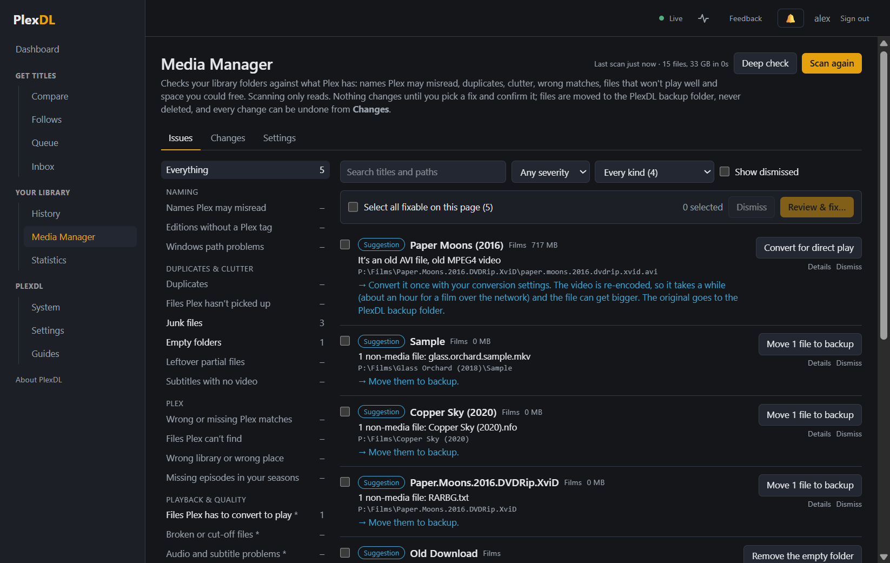

# Media Manager

Media Manager looks after **your own** library: names Plex may misread, duplicates, files Plex hasn't picked
up, wrong matches, files Plex has to convert to play, broken files, clutter and space you could free.

## It's safe by design

- **Scanning only reads.** Nothing changes until you choose a fix and confirm it.
- **Nothing is deleted.** Files that are replaced or removed move to the `PlexDL Backup` folder next to the
  library. The only exceptions are deleting PlexDL's own backups, after you tick to confirm, and the nightly
  clean-up of old backups if you turn it on.
- **Every change can be undone** from the **Changes** tab.
- If PlexDL is stopped part-way through a fix, it puts the files back where they were when it next starts.

## Scanning

**Scan now** reads every library folder and compares it with what Plex has (a few minutes for a large
library). **Deep check** also looks inside every video with ffprobe to find broken files and audio or subtitle
problems; the first one takes a while (about half an hour for 12,000 files over the network), later ones only
read files that changed. You can turn on a **weekly scan** in Media Manager → Settings; it tells you about new
issues only.

## Working through the issues

The checks are grouped on the left (Naming, Duplicates & clutter, Plex, Playback & quality, Storage) with how
many each found. Pick one to see its issues. Each says what's wrong, why it matters, what the fix will do and the
exact files involved (**Details**).

- **Kind of problem** narrows a check down (for example *DTS/TrueHD audio only* or *Forced picture subtitle*
  under "Files Plex has to convert to play").
- Tick issues, or **Select all fixable on this page**, or **select all N in this list** (every issue matching your
  filters, not just the 100 on screen), then **Review & fix…** to see every change before it happens.
- Choose **Now** or **Later, at** a time (for example 02:00), so big jobs run overnight. Scheduled batches are
  listed at the top with **Cancel**.
- While a batch is running you can still add more: they wait their turn and start as soon as it finishes.
- **Dismiss** hides an issue you're happy with (it stays hidden after later scans; **Show dismissed** brings it
  back).

Conversions take time: a quick repackage of a TV episode takes a few minutes over the network; re-encoding a
film can take about an hour.

**Empty folders** are checked twice. The fix looks at the whole folder again first and refuses if anything is in
it now. Then it removes the folders one by one, deepest first, in a way that stops at any folder that isn't
empty. So a file copied in at that moment stops the removal; it's never deleted with the folder. Removed folders
come back with **Undo**. "Empty" means no files at all: a folder with only a `Thumbs.db` or a subtitle in it isn't
listed. A show folder can end up empty when its episodes were moved or deleted outside Plex. Check
**Files Plex can't find** for that show before removing it.

## Night shift

For the long jobs (the files Plex has to convert to play, and files that could be much smaller), turn on
**Night shift** in Media Manager → Settings and choose a window, for example 01:00 to 07:00. Every night in that
window, Media Manager converts those files one at a time, the most serious first, until there are none left. It
doesn't start a new one after the window ends; one already running finishes. A file that can't be converted is
skipped for the rest of that night. You get a summary each morning that it did something, and a note when it's
all done; a later scan that finds more gets picked up the next night. The top of the page shows how many are
left. Every conversion is in **Changes** with **Undo**, like any other fix.

## Plex upkeep

The **Plex upkeep** box runs Plex's own maintenance: **Empty trash** (forget titles whose files are gone),
**Clean bundles** and **Optimise the Plex database**. Each shows its progress as Plex works, when it was last run
from PlexDL, whether Plex already does it by itself, and **Recommended** when there's a reason to run it now.

## PlexDL backups

Files that PlexDL replaces (upgrades, fixes) or takes out (History's Undo) go to a `PlexDL Backup` folder next to
each library. The **PlexDL backups** box (under Plex upkeep) shows how much space they take, how much of that is
older than the age set in Settings (30 days to start with), and the free space on each drive. **Check again**
looks afresh; otherwise it's checked every 10 minutes when you look.

- **Delete older than 30 days** deletes just the old ones.
- **Empty now…** deletes everything in the backup folders.

Both ask you to tick **I understand this can't be undone** first: once a backup is gone, the change that put it
there can't be undone any more. Each backup is checked again just before it's deleted, and anything that changed
since is left alone. If more backups have appeared since you looked, nothing is deleted and the new figures are
shown for you to confirm again. Nothing outside the backup folders is ever touched, and only folders PlexDL made
are counted: anything else you keep in there is left alone. A backup folder set in Settings that holds a library
folder isn't used (PlexDL uses `PlexDL Backup` at the top of the drive instead). Entries under Changes whose
backups are deleted are marked as no longer undoable.

To keep them in check by themselves, turn on **Delete PlexDL backups older than N days by itself, each night** in
Media Manager → Settings. Once a night (after 03:00) PlexDL deletes the old ones and tells you how much it
freed. It's off until you turn it on.

## If something was interrupted

If a fix couldn't be put back automatically after a restart (for example because a drive wasn't reachable), a red
box at the top lists what's left. PlexDL tries again every minute. If you sort the files out yourself, tick
**I've put these right by hand** and **Forget it**. New changes wait until then.

## Settings

Media Manager → Settings: file types never called junk (for example `nfo` if you keep those), how old PlexDL
backups must be before they're offered for deletion, when a film counts as "not watched for years", the weekly
scan, and whether 10-bit H.264 is converted to HEVC (smaller, plays on most TVs) or 8-bit H.264 (plays on older
devices too).
